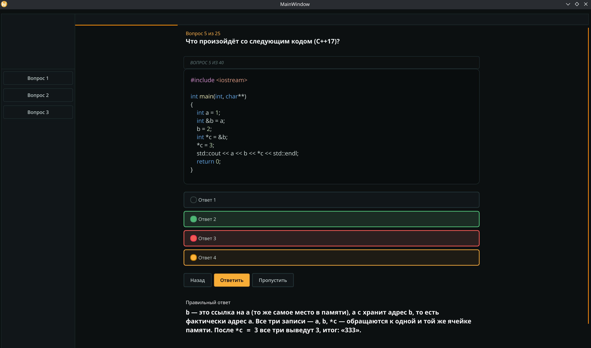

# CodeForge


CodeForge — десктопное Qt6-приложение для тренировки и проверки знаний C++: от базового синтаксиса и типов до продвинутых тем — шаблонов, STL, работы с памятью. Задумано не только для себя, а как инструмент для других — например, для одногруппников, которым нужно подготовиться к зачётам или собеседованиям. Пользователь проходит вопросы с вариантами ответов, часть из которых сопровождается фрагментом кода с подсветкой синтаксиса, и получает объяснение после ответа.



## Содержание

- [Возможности](#возможности)
- [Архитектура](#архитектура)
- [Стек](#стек)
- [Сборка](#сборка)
- [Структура проекта](#структура-проекта)
- [Планы](#планы)

## Возможности

- 📝 Вопросы разных типов: с одним верным вариантом, с несколькими верными вариантами, с кодом и без
- 🎨 Подсветка синтаксиса C++ в стиле VS Code Dark+ прямо в вопросах с кодом
- 📄 Квиз разбит на страницы с навигацией вперёд/назад
- 🖼 Фон с затемняющим оверлеем, который подстраивается под размер окна
- ✅ Плавный, отзывчивый интерфейс: увеличенные чекбоксы, авто-растягивающиеся под код текстовые поля, плавная прокрутка

## Архитектура

| Модуль | Назначение |
|---|---|
| `PageFactory` / `PageNavigator` | группировка вопросов по страницам и переключение между ними |
| `QuizController` | состояние текущего вопроса и выбранных ответов |
| `CppSyntaxHighlighter` | подсветка синтаксиса C++ в блоках кода |
| `BackgroundManager` | масштабирование и затемнение фонового изображения |
| `SideBarBuilder` | динамическая сборка боковой панели |
| `BigCheckBox`, `CodePlainTextEdit`, `SmoothScrollArea` | кастомные виджеты UI |

## Стек

| Компонент | Технология |
|---|---|
| Язык | C++20 |
| UI-фреймворк | Qt6 (Core, Widgets, Gui, Qml, Quick, Charts, Network) |
| Сборка | CMake 3.21+, автоматизация MOC/UIC/RCC |

## Сборка

```bash
git clone https://github.com/Krona-org/CodeForge.git
cd CodeForge
cmake -S . -B build -DCMAKE_PREFIX_PATH=<путь_к_Qt6>
cmake --build build
```

Собранный исполняемый файл — `math_guide` (целевое имя задано в `CMakeLists.txt`).

## Структура проекта

```
src/
├── core/     # логика квиза: вопросы, страницы, навигация, подсветка синтаксиса
├── ui/       # главное окно (mainwindow.h/.cpp/.ui)
├── widget/   # кастомные виджеты
├── style/    # хелперы стилей (QSS)
└── main.cpp
res/          # ресурсы (изображения)
```

## Планы

- [ ] Определиться с источником вопросов — сейчас захардкожены, планируется вынести во внешний формат (JSON/БД)
- [ ] Расширить банк вопросов от базовых тем до продвинутых (шаблоны, STL, память)
- [ ] Сохранение прогресса и статистики прохождения

> Проект на ранней стадии: часть логики квиза ещё дорабатывается.
